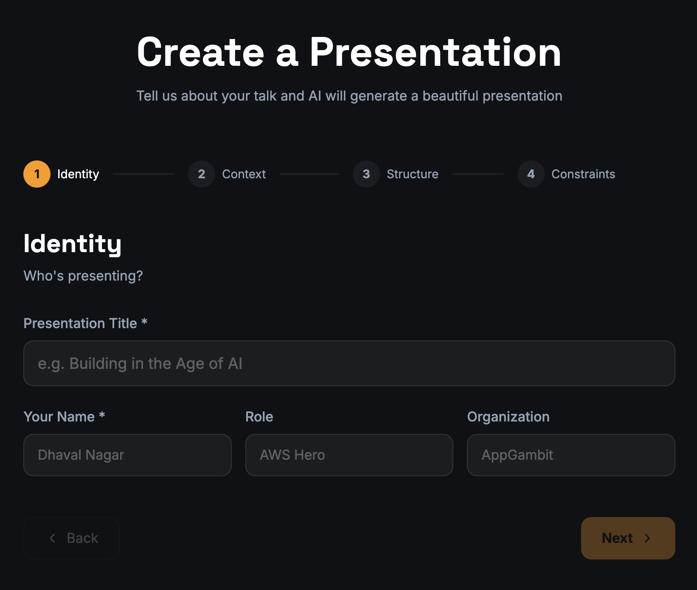
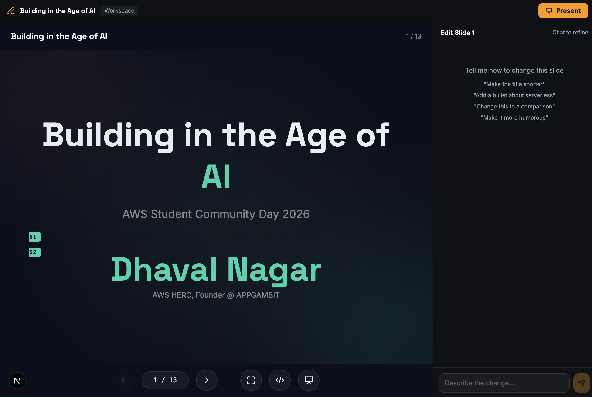

# Presentify

Open-source AI-powered presentation builder. Describe your talk, AI generates beautiful animated slides. Edit with chat or click.

> **⚠️ IMPORTANT: No authentication is included.** This app uses your Anthropic API key on the backend (`ANTHROPIC_API_KEY`). Every presentation generation and chat edit makes real API calls — Opus for planning, Sonnet for each slide and edit. **Do NOT deploy publicly without adding authentication**, or anyone can use your API key and run up costs. This is designed for **local use or private/internal deployments only**.




## Quick Start

```bash
npm install
echo "ANTHROPIC_API_KEY=sk-ant-..." > .env.local
npm run dev
```

Visit [http://localhost:3000](http://localhost:3000)

## What It Does

1. **Describe your talk** — 4-step form: topic, audience, tone, duration
2. **AI plans the structure** — Claude Opus generates an outline you can review/edit
3. **AI creates slides** — Claude Sonnet generates each slide with components and styling
4. **Edit 3 ways** — Chat ("make S2 more concise"), click-to-edit text, or raw JSON editor
5. **Present** — Full-screen animated presentation with keyboard navigation

## Tech Stack

- **Next.js** (App Router) + **TypeScript**
- **Anthropic Claude** — Opus for planning, Sonnet for content generation and editing
- **Tailwind CSS v4** + **Motion/React** (spring animations)
- **Lucide React** (icons) + **Recharts** (charts) + **react-qr-code**
- **localStorage** for persistence (no database)

## Routes

| Route | What |
|-------|------|
| `/` | Landing page |
| `/create` | Intake form → outline approval → AI generation |
| `/p/[id]` | Workspace: preview + chat editing + section IDs |
| `/p/[id]/present` | Full-screen presentation mode |
| `/p/sample/present` | Built-in sample presentation |

## Keyboard Shortcuts

| Key | Action |
|-----|--------|
| `→` / `Space` | Next slide |
| `←` | Previous slide |
| `F` | Fullscreen |
| `E` | JSON editor |

## Slide Data Model

Each slide is ~15 lines of JSON:

```json
{
  "title": "AI is Your Superpower",
  "titleAccent": "Superpower",
  "sections": [
    {
      "type": "columns",
      "columns": [
        { "component": "BulletList", "props": { "items": ["Write S3 policies", "Scaffold CDK"], "icon": "check-circle" } },
        { "component": "IconCard", "props": { "title": "Ship Fast", "desc": "Days not months", "layout": "horizontal" } }
      ],
      "style": { "fontSize": "110%" }
    }
  ]
}
```

### 20 Components

Body, BulletList, NumberedSteps, ComparisonTable, StatCallout, QuoteBlock, IconCard, CardGrid, CTABox, CodeBlock, ChartBlock, ImageBlock, TagList, ShowcaseCard, HeroIcon, PromptBlock, Divider, Spacer, Heading, TwoColumn

### Section Styles

```json
"style": { "align": "center", "fontSize": "125%", "glass": true, "accent": "#FF9900" }
```

Per-column styles also supported.

## Project Structure

```
src/
  app/           # Next.js routes + API
  agents/        # Claude AI agents (outline, theme, slides, edit)
  components/
    slides/      # 20 slide components
    renderer/    # SlideRenderer, PresentationRenderer, ThemeProvider
    workspace/   # ChatPanel
    intake/      # IntakeWizard
  lib/           # Types, store, icon resolver, markdown parser
  styles/        # Global CSS + theme variables
```

## Roadmap

- [ ] Authentication (protect API routes)
- [ ] BYOK (Bring Your Own Key) per user
- [ ] Export as standalone HTML
- [ ] Export as downloadable project
- [ ] MCP integration (web search, images)
- [ ] Drag-to-reorder slides
- [ ] Dark/light toggle

## Deploy

Works on Vercel, Netlify, or any Node.js host. Set `ANTHROPIC_API_KEY` as environment variable.

**Before deploying publicly:** Add authentication (e.g. NextAuth, Clerk) to protect the API routes. Without auth, anyone can trigger API calls on your key. See the roadmap for planned auth support.

## License

MIT
